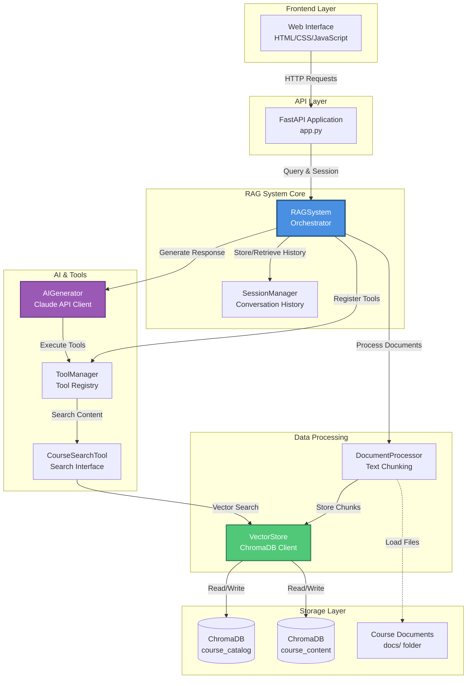
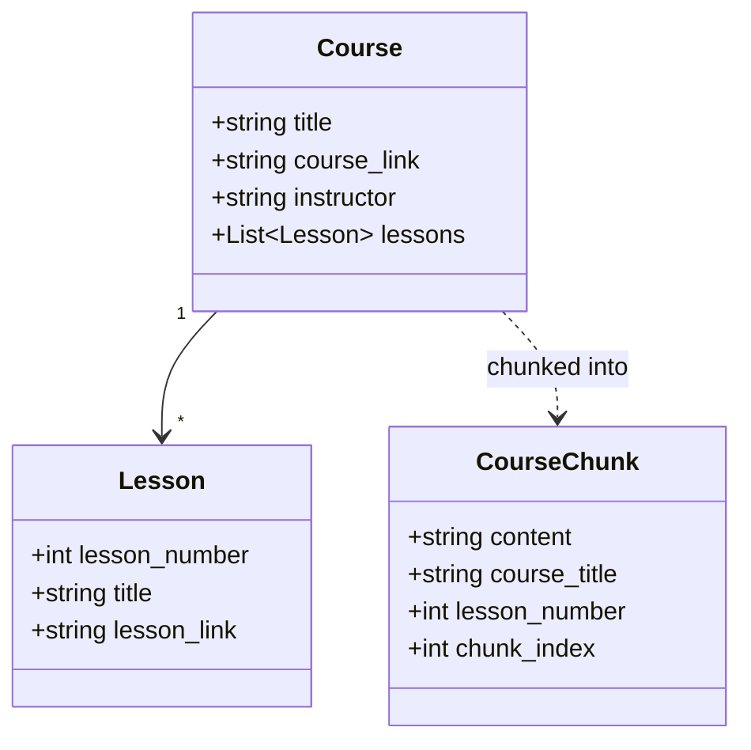
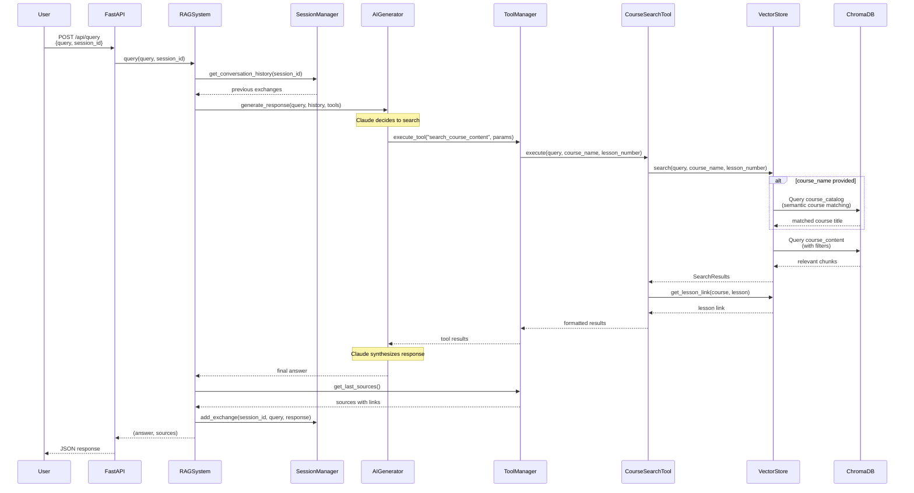
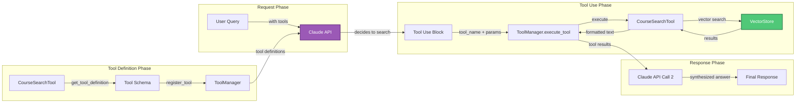
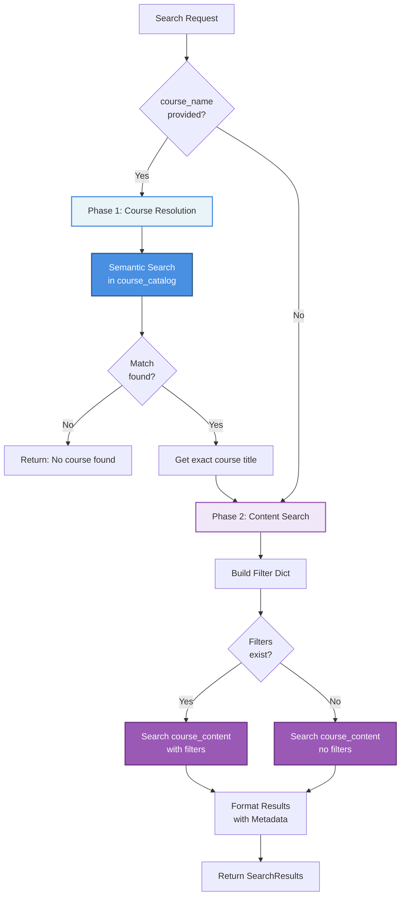
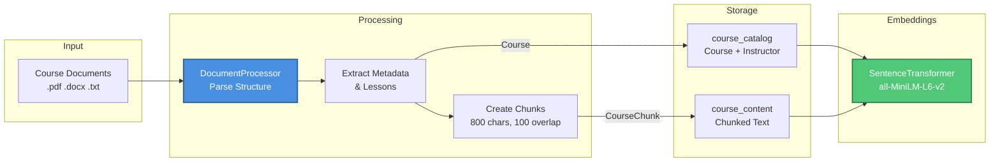
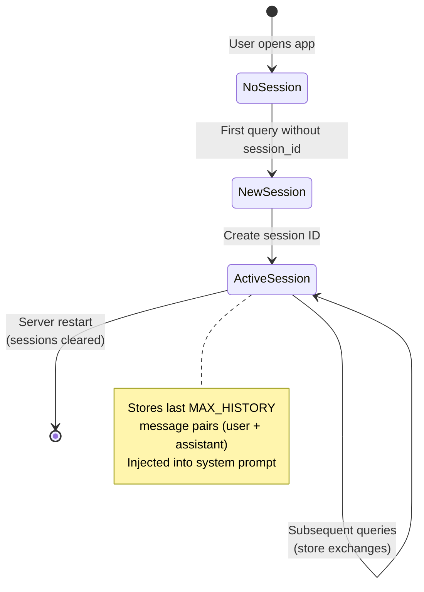

# Architecture Documentation

This document provides a comprehensive overview of the RAG (Retrieval-Augmented Generation) system architecture, including component interactions, data flows, and key processes.

## System Overview

The RAG system is built as a full-stack application that enables intelligent querying of course materials using semantic search and AI-powered responses. It combines ChromaDB for vector storage, Anthropic's Claude API for natural language processing, and a web interface for user interaction.

## High-Level Architecture



## Core Components

### 1. RAGSystem (rag_system.py)
The central orchestrator that coordinates all system components:
- Initializes and manages all core components
- Handles document ingestion and processing
- Coordinates query processing with tool-based search
- Manages conversation sessions
- **Key Methods:**
  - `add_course_document()`: Process and store a single course
  - `add_course_folder()`: Batch process course documents
  - `query()`: Process user queries with RAG pipeline

### 2. VectorStore (vector_store.py)
Manages two ChromaDB collections for semantic search:
- **course_catalog**: Course metadata for semantic course name matching
- **course_content**: Chunked lesson content with embeddings
- **Key Features:**
  - Two-phase search (course resolution + content search)
  - Semantic course name matching
  - Flexible filtering by course and lesson
  - SentenceTransformer embeddings (all-MiniLM-L6-v2)

### 3. AIGenerator (ai_generator.py)
Handles Claude API interactions:
- Manages API client and parameters
- Supports tool-calling with Anthropic's API
- Handles multi-turn conversations with history
- Enforces "one search per query maximum" via system prompt

### 4. ToolManager & CourseSearchTool (search_tools.py)
Implements extensible tool system:
- **ToolManager**: Registry for tools available to Claude
- **CourseSearchTool**: Executes semantic search operations
- Tracks sources with links for UI display
- Enables Claude to decide when to search

### 5. DocumentProcessor (document_processor.py)
Parses and chunks course documents:
- Supports PDF, DOCX, and TXT formats
- Creates overlapping chunks (800 chars, 100 overlap)
- Extracts course metadata and lesson structure

### 6. SessionManager (session_manager.py)
Manages conversation state:
- Creates unique session IDs
- Maintains last N message pairs (default: 2)
- Injects history into Claude's system prompt
- In-memory storage (resets on server restart)

## Data Models



## Query Processing Flow



## Tool-Calling Architecture

The system uses Anthropic's tool-calling API instead of manual RAG retrieval:



**Key Benefits:**
- Claude decides when to search (no forced retrieval)
- Natural language tool parameters
- Cleaner separation of concerns
- "One search per query maximum" enforced by system prompt

## Vector Search Strategy

The VectorStore implements a two-phase search for flexible queries:



**Example:**
Query: "search for 'tool calling' in the MCP course"
1. **Phase 1**: "MCP" → semantic search in course_catalog → resolves to "Introduction to Model Context Protocol"
2. **Phase 2**: Search for "tool calling" in course_content filtered by course_title = "Introduction to Model Context Protocol"

## Document Processing Pipeline



**Document Format:**
```
Course Title: [title]
Course Link: [url]
Course Instructor: [name]

Lesson 0: [lesson title]
Lesson Link: [lesson url]
[lesson content]

Lesson 1: [lesson title]
...
```

## API Endpoints

### POST /api/query
Process user queries with RAG system.

**Request:**
```json
{
  "query": "What is tool calling?",
  "session_id": "optional-session-id"
}
```

**Response:**
```json
{
  "answer": "Tool calling is...",
  "sources": [
    {
      "text": "Introduction to MCP - Lesson 3",
      "link": "https://example.com/lesson3"
    }
  ],
  "session_id": "session-12345"
}
```

### GET /api/courses
Get course catalog analytics.

**Response:**
```json
{
  "total_courses": 5,
  "course_titles": ["Course 1", "Course 2", ...]
}
```

## Configuration

Key settings in `backend/config.py`:

| Setting | Default | Description |
|---------|---------|-------------|
| ANTHROPIC_MODEL | claude-sonnet-4-20250514 | Claude model version |
| EMBEDDING_MODEL | all-MiniLM-L6-v2 | SentenceTransformer model |
| CHUNK_SIZE | 800 | Characters per chunk |
| CHUNK_OVERLAP | 100 | Overlap between chunks |
| MAX_RESULTS | 5 | Max search results |
| MAX_HISTORY | 2 | Conversation turns retained |
| CHROMA_PATH | ./chroma_db | ChromaDB persistence path |

## Extensibility

### Adding New Tools

To extend the system with new capabilities:

1. Create a class inheriting from `Tool` (in `backend/search_tools.py`)
2. Implement required methods:
   ```python
   class MyTool(Tool):
       def get_tool_definition(self) -> dict:
           return {
               "name": "my_tool",
               "description": "What this tool does",
               "input_schema": {...}
           }

       def execute(self, **kwargs) -> str:
           # Tool logic here
           return "result"
   ```
3. Register with ToolManager in `backend/rag_system.py`:
   ```python
   my_tool = MyTool()
   self.tool_manager.register_tool(my_tool)
   ```

### Supporting New Document Formats

Extend `DocumentProcessor` to parse additional file types beyond PDF, DOCX, and TXT.

## Session Management

Sessions maintain conversation continuity:



**Note:** Sessions are stored in-memory and reset on server restart. For production, consider persistent session storage.

## Deployment Considerations

1. **ChromaDB Persistence**: Stored in `./chroma_db` - ensure this directory is backed up
2. **API Keys**: Store `ANTHROPIC_API_KEY` securely in `.env` file
3. **Document Loading**: Documents loaded from `../docs` on startup
4. **Performance**: Embedding model runs locally (all-MiniLM-L6-v2 is lightweight)
5. **Scaling**: Consider Redis for session management in production

## References

- CLAUDE.md: Detailed development instructions
- backend/config.py: Configuration settings
- backend/rag_system.py: Main orchestrator implementation
